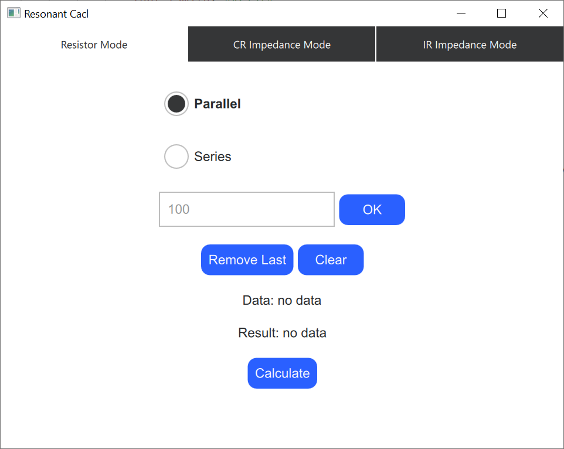
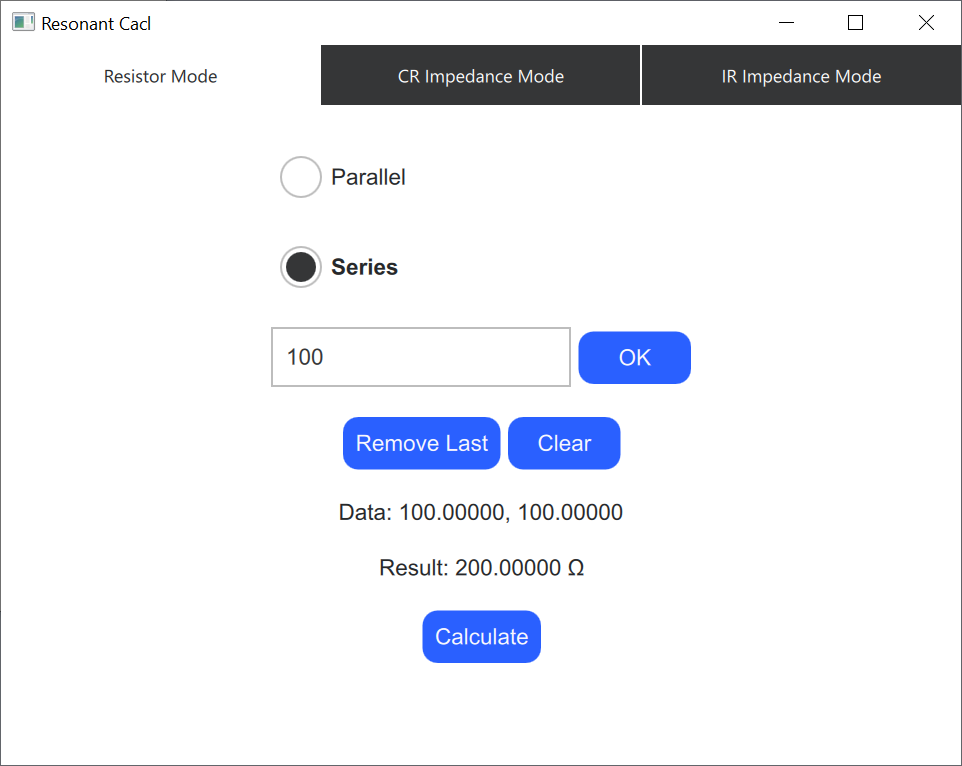
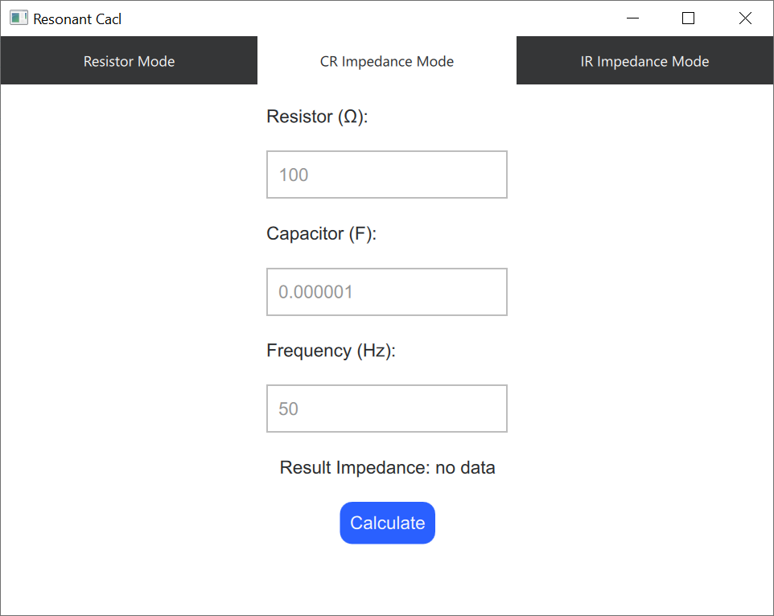
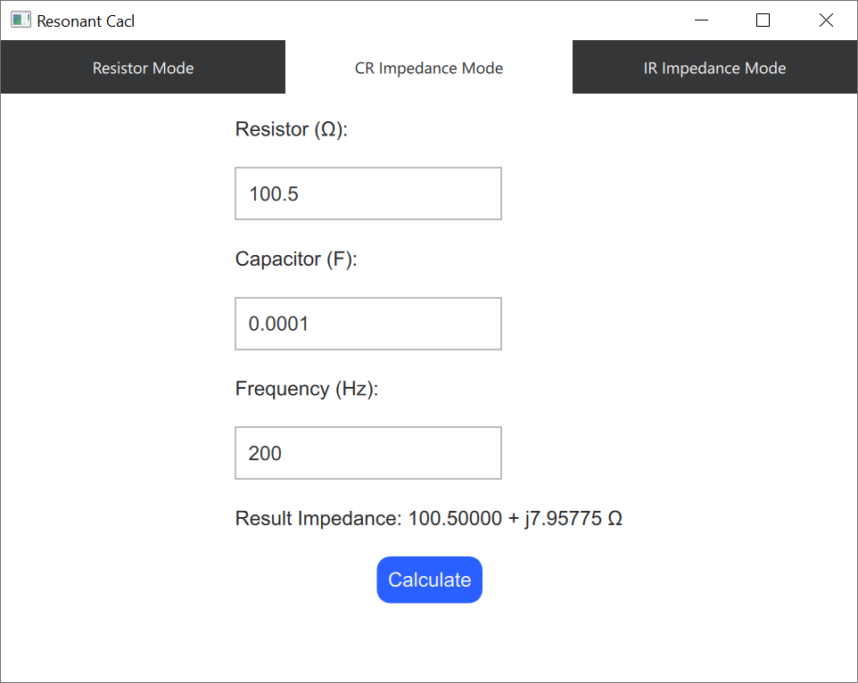
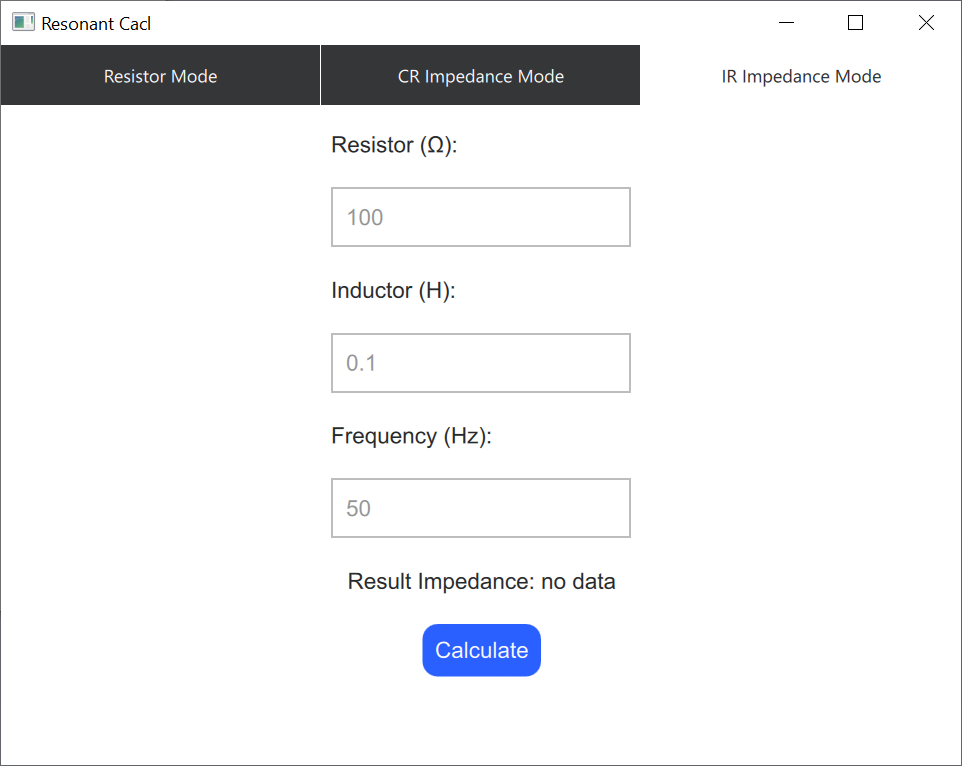
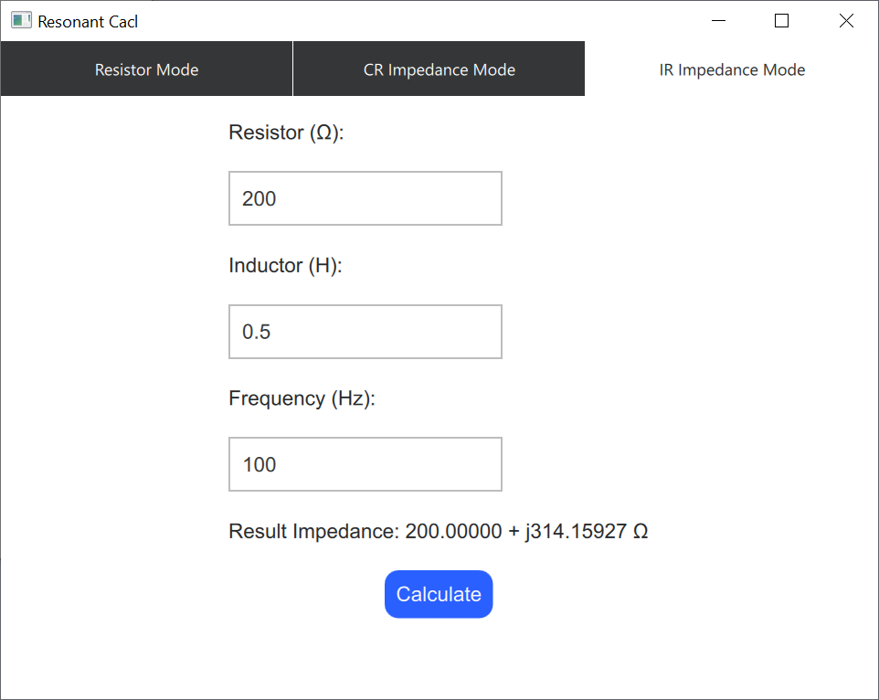

# MZenko Test Task
## Description
Create a program on Qt QML + C++.
The main tasks of the program:
- calculation of resistance of parallel and series connection of resistors
- calculation of the impedance of a series connection of a capacitor and a resistor
- calculation of the impedance of the serial connection of the inductor and the resistor

Enable the user to choose the type of calculation, enter data in text fields. Display the result after pressing the button.
Implement a graphical user interface using QML.
All calculations must be done on the C++ side
## How to use
The user has 3 tabs for each type of calculation (by tasks):
- Resistor Mode
- CR Impedance Mode
- LR Impedance Mode

The `Resistor Mode` tab has:
- 2 radio buttons for choosing connection type of resistors
- text field for enter resistor value (ohm, Ω)
- button `Ok` intended for confirm entered resistor value
- buttons `Remove Last` and `Clear` if user has to delete last entered resistor value or wants to enter new data set
- label `Data: ...` displays current list of data set
- by clicking on `Calculate` buttons label `Result: ...` changes its state depending of data (calculated value or `no data` message)

The `CR Impedance Mode` tab has:
- text field for enter resistor value (ohm, Ω)
- text field for enter capasitor value (farad, F)
- text field for enter frequency value (hertz, Hz)
- by clicking on `Calculate` buttons label `Result: ...` changes its state depending of data (calculated value or `no data` message)

The `IR Impedance Mode` tab same design as `CR Impedance Mode` tab:
- text field for enter resistor value (ohm, Ω)
- text field for enter inductor value (henry, H)
- text field for enter frequency value (hertz, Hz)
- by clicking on `Calculate` buttons label `Result: ...` changes its state depending of data (calculated value or `no data` message)

Each text field accepts a dot-separated float value greater than zero and has sample value hints.
Each label has precision 5 values ​​after the dot.
## How to run
For Windows just need to download and unpack QtQmlResonantCalc.rar from
[last release](https://github.com/NazarFrenk/mzenko-test-task/releases).
## Example output
`Resistor Mode`

`CR Impedance Mode`

`IR Impedance Mode`

